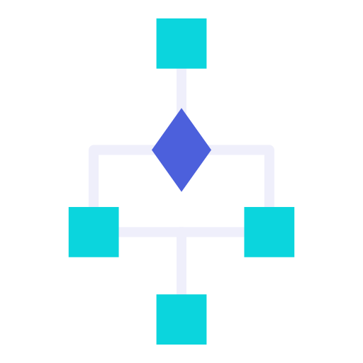

# Algorithms2024-25
Repo contains an solving the problem of algorithms and data stucture  write in C++

## Methods:
- **Sorting**:
  - Insertion Sort
  - Bubble Sort
- **Selection Algorithms**
- **Linear Time Sorting**
- **Binary Heap**
- **Backtracking**
- **Dynamic Programming**
- **Graph Traversal**:
  - BFS (Breadth-First Search)
  - DFS (Depth-First Search)
- **Greedy Algorithms**
- **Divide and Conquer**

## Data Structures:
- **Binary Search Tree (BST)**
- **Queue**
- **Linked List**

## all the task is here: [a relative link](TASK_IN_OUT.md)
